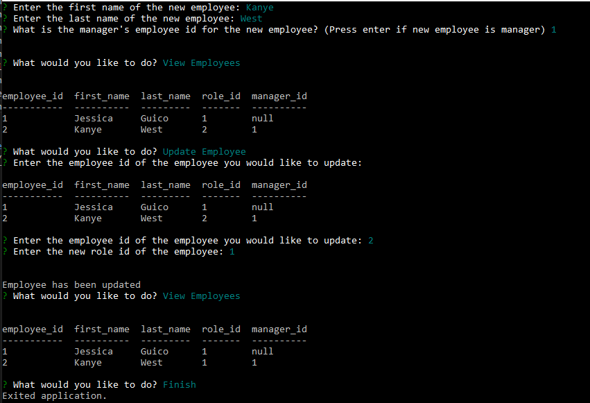

# Employee Management System

## Description

This is a command-line application that accepts user input. 

When the user starts the application the user is presented with a menu with the following options: view all departments, view all roles, view all employees, add a department, add a role, add an employee, and update an employee role.

When the user chooses to view all departments, they are presented with a table with all the existing departments.

When the user chooses to view all roles, they are presented with a table with all the existing roles.

When the user chooses to view all employees, they are presented with a table with all the existing employees.

When the user chooses to add a department, they are prompted to enter the name of the department.

When the user chooses to add a role, the user is prompted to fulfill a series of prompts. A table of existing departments is also presented to help make selecting a department id easier.

When the user chooses to add an employee, the user is prompted to fulfill a series of prompts about the new employee. A table of existing roles is also presented to help make selecting a role id easier.

When the user chooses to update an employee, the user is prompted to fulfill a series of prompts about which employee needs updating and to which role they are updating to. A table of existing employees is also presented to help make selecting a role id and employee id easier.

When the user chooses to finish, the application closes.

## Live Link
https://watch.screencastify.com/v/2oTxbTJoLsww3XzrojRT